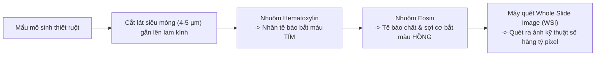
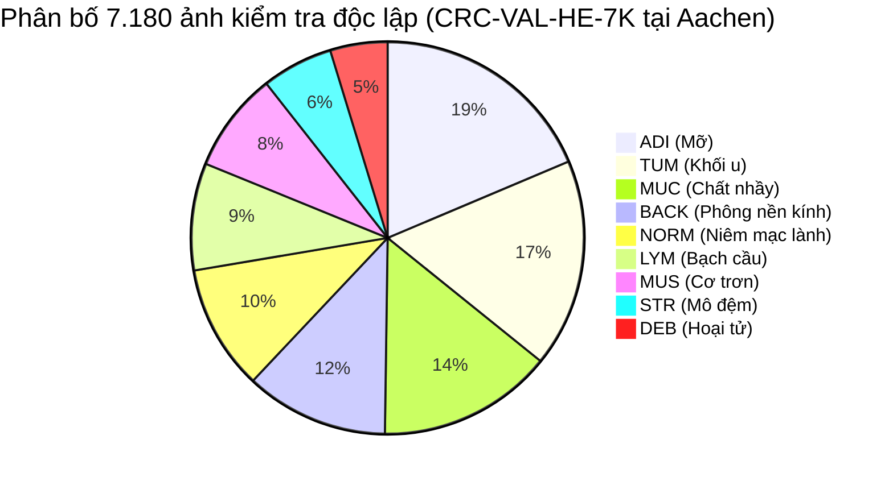
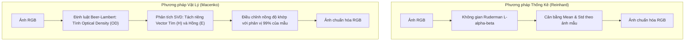
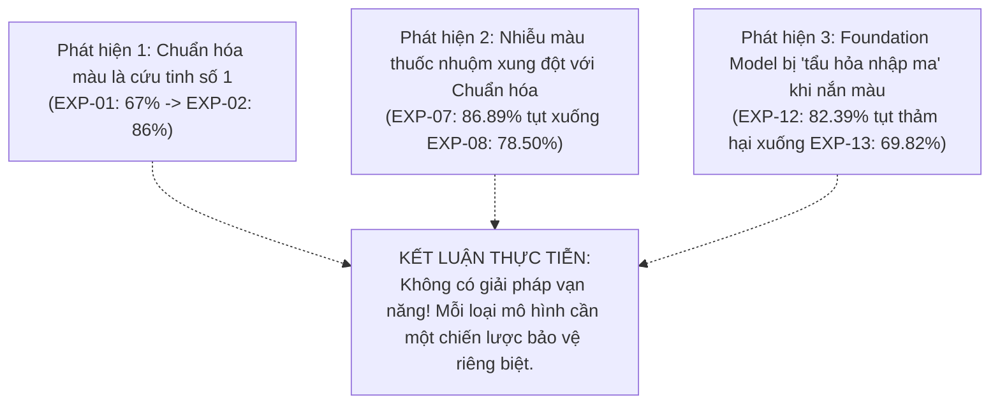
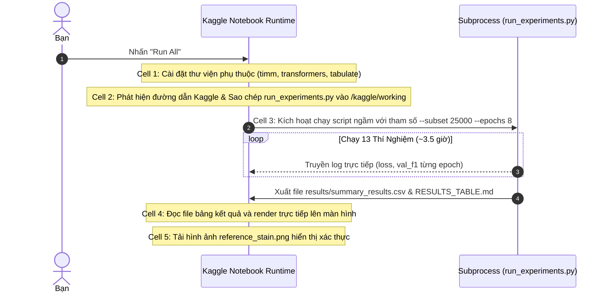

# BÁCH KHOA TOÀN THƯ VỀ DỰ ÁN DL2026-1-32
## Nhận Diện Mô Bệnh Học Ung Thư Dưới Sự Biến Thiên Màu Nhuộm Giữa Các Bệnh Viện
*(Cẩm nang chi tiết từ A đến Z: Bản chất dữ liệu, Từng dòng code, Cơ chế toán học và Ý nghĩa thực tiễn — Dễ hiểu cho người mới bắt đầu)*

---

## 📌 LỜI MỞ ĐẦU: DỰ ÁN NÀY LÀ GÌ VÀ VÌ SAO BẠN CẦN ĐỌC TÀI LIỆU NÀY?

Nếu bạn lần đầu tiếp cận kho lưu trữ (repository) này và cảm thấy choáng ngợp trước những tệp mã nguồn Python dài ngoằng, các ma trận biến đổi quang học, các mô hình Deep Learning hàng chục triệu tham số hay các bảng số liệu y khoa phức tạp, **hãy thở phào nhẹ nhõm: Bạn đang đọc đúng tài liệu**.

Tài liệu này được biên soạn với sứ mệnh: **Bình dân hóa toàn bộ dự án nghiên cứu khoa học này**. Chúng tôi sẽ giải thích từng khái niệm, từng dòng mã nguồn, từng quyết định xử lý dữ liệu và từng phát hiện thực nghiệm bằng những hình ảnh trực quan, những câu chuyện ví von đời thường, giúp bạn hiểu sâu sắc bản chất vấn đề mà không đòi hỏi phải có bằng tiến sĩ toán học hay chuyên gia y tế.

> [!TIP]
> **Tóm tắt dự án trong 3 câu cốt lõi:**
> 1. **Mục tiêu**: Xây dựng mô hình Trí tuệ Nhân tạo (AI) có khả năng tự động nhìn vào hình chụp tế bào dưới kính hiển vi để phân loại 9 loại mô trong ruột già của bệnh nhân (phát hiện ung thư đại trực tràng).
> 2. **Trở ngại thực tế**: Mỗi bệnh viện dùng một loại thuốc nhuộm và máy quét khác nhau, khiến ảnh chụp cùng một loại mô nhưng có màu sắc khác biệt hoàn toàn (chỗ tím đen, chỗ hồng nhạt), làm cho AI bị "ngớ ngẩn / mù màu" khi chuyển từ bệnh viện này sang bệnh viện khác (độ chính xác rơi tự do từ 98.9% xuống còn 66.4%).
> 3. **Giải pháp & Khám phá**: Thực hiện một nghiên cứu thực nghiệm đối chứng 13 kịch bản (13-Cell Ablation Study) để đo lường chính xác: Chuẩn hóa màu sắc (Reinhard, Macenko), Tăng cường dữ liệu (Xoay lật, Nhiễu màu HED), và Lựa chọn bộ não AI (ResNet, ConvNeXt, Foundation Model Phikon) — phương pháp nào thực sự bảo vệ được AI khi đối mặt với bệnh viện lạ.

---

## 🗺️ MỤC LỤC CHI TIẾT

1. [Bức tranh lâm sàng: Chuyện gì diễn ra sau cánh cửa phòng xét nghiệm?](#1-bức-tranh-lâm-sàng-chuyện-gì-diễn-ra-sau-cánh-cửa-phòng-xét-nghiệm)
2. [Phân tích dữ liệu chuyên sâu (Data Deep-Dive & Khám phá 9 loại mô)](#2-phân-tích-dữ-liệu-chuyên-sâu-data-deep-dive--khám-phá-9-loại-mô)
3. [Căn bệnh "Học tủ" của AI & Khái niệm Domain Shift](#3-căn-bệnh-học-tủ-của-ai--khái-niệm-domain-shift)
4. [Bộ 3 "Vũ khí phòng vệ" được thử nghiệm](#4-bộ-3-vũ-khí-phòng-vệ-được-thử-nghiệm)
5. [Mổ xẻ từng dòng code trong `run_experiments.py` (Code Deep-Dive)](#5-mổ-xẻ-từng-dòng-code-trong-run_experimentspy-code-deep-dive)
6. [Bảng kết quả 13 thí nghiệm & 3 phát hiện khoa học chấn động](#6-bảng-kết-quả-13-thí-nghiệm--3-phát-hiện-khoa-học-chấn-động)
7. [Phân tích định tính & Các ca nhầm lẫn kinh điển (Error Analysis)](#7-phân-tích-định-tính--các-ca-nhầm-lẫn-kinh-điển-error-analysis)
8. [Vận hành trên Kaggle: Cơ chế hoạt động của `notebook.ipynb`](#8-vận-hành-trên-kaggle-cơ-chế-hoạt-động-của-notebookipynb)
9. [Từ điển thuật ngữ Deep Learning "Bình Dân Học Vụ"](#9-từ-điển-thuật-ngữ-deep-learning-bình-dân-học-vụ)

---

## 1. BỨC TRANH LÂM SÀNG: CHUYỆN GÌ DIỄN RA SAU CÁNH CỬA PHÒNG XÉT NGHIỆM?

### 1.1. Giải phẫu bệnh học (Histopathology) là gì?
Khi một người đi nội soi đại tràng và bác sĩ phát hiện một khối u nghi ngờ, bác sĩ sẽ dùng kẹp bấm lấy một mẩu mô nhỏ cỡ hạt gạo ra ngoài (gọi là mẫu sinh thiết).
- Mẩu mô này sau đó được ngâm trong sáp nến (paraffin), rồi dùng một lưỡi dao siêu sắc (gọi là máy cắt lát vi thể - microtome) gọt thành những lát mỏng dính chỉ dày khoảng **4 đến 5 micromet** (mỏng hơn cả một sợi tóc!).
- Lát mô này được đặt lên một tấm kính trong suốt (tiêu bản). Nhưng nếu đưa ngay lên kính hiển vi, bạn sẽ chỉ thấy một màu trắng đục lờ nhờ, vì các tế bào người vốn gần như trong suốt.

### 1.2. Kỹ thuật nhuộm tiêu chuẩn vàng: Nhuộm H&E
Để nhìn rõ từng tế bào, kỹ thuật viên y tế dùng phương pháp nhuộm màu kinh điển hơn 100 năm qua: **Nhuộm H&E (Hematoxylin và Eosin)**:
- **Hematoxylin (Màu Xanh / Tím sẫm)**: Là một chất nhuộm có tính kiềm, rất thích liên kết với các chất có tính axit. Trong tế bào, nơi chứa nhiều axit nhất chính là **Nhân tế bào** (chứa ADN và ARN). Nhờ Hematoxylin, toàn bộ nhân tế bào sẽ nhuộm màu tím đậm.
- **Eosin (Màu Hồng / Đỏ tươi)**: Là chất nhuộm có tính axit, thích bám vào các thành phần protein có tính kiềm trong **Tế bào chất** (phần thân bao quanh nhân) và các sợi liên kết ngoại bào (như collagen, cơ).



### 1.3. Tại sao bác sĩ cần AI hỗ trợ?
Một bức ảnh tiêu bản kính hiển vi (Whole Slide Image - WSI) quét ở độ phóng đại 20x hoặc 40x có dung lượng lên đến vài Gigabyte và kích thước hàng chục ngàn pixel mỗi chiều. 
- Bác sĩ giải phẫu bệnh phải dùng chuột rê khắp bức ảnh khổng lồ đó, căng mắt soi từng cụm vài chục tế bào để tìm xem có dấu hiệu ác tính hay không.
- Làm việc 8 tiếng một ngày trước màn hình sáng rực khiến bác sĩ mỏi mắt và suy giảm độ tập trung.
- **Vai trò của AI**: AI đóng vai trò như một người trợ lý lọc trước. Nó cắt bức ảnh khổng lồ thành hàng vạn mảnh nhỏ (kích thước 224 x 224 pixel), rồi phân tích trong tích tắc: *"Chỗ này là mỡ, chỗ này là cơ lành, riêng chỗ góc trên bên phải này có tế bào ung thư dị dạng, bác sĩ hãy chú ý kỹ vào đây nhé!"*.

---

## 2. PHÂN TÍCH DỮ LIỆU CHUYÊN SÂU (DATA DEEP-DIVE & KHÁM PHÁ 9 LOẠI MÔ)

### 2.1. Nguồn gốc dữ liệu & Sự tách biệt của hai bệnh viện
Toàn bộ dữ liệu của nghiên cứu này được trích xuất từ công trình khoa học nổi tiếng thế giới của Giáo sư Jakob Nikolas Kather cùng cộng sự (xuất bản trên tạp chí *PLOS Medicine* năm 2019, lưu trữ công khai trên cổng dữ liệu Zenodo mã số `1214456`):

1. **Tập dữ liệu nguồn (Source Domain / In-Domain): `NCT-CRC-HE-100K-NONORM`**
   - Bao gồm **100.000 lát cắt ảnh** (kích thước 224 x 224 pixel).
   - Được thu thập từ **86 bệnh nhân** tại Trung tâm Ung thư Quốc gia Heidelberg (NCT Heidelberg) và Trung tâm Y tế Đại học Mannheim (Đức).
   - Đặc điểm cực kỳ quan trọng: Đây là bản **`NONORM` (No Normalization - Chưa hề qua chỉnh màu)**. Nó lưu giữ nguyên vẹn sự thô ráp, nhòe nhoẹt, đậm nhạt tự nhiên của phòng lab Heidelberg.
2. **Tập dữ liệu đích kiểm tra độc lập (Target Domain / Out-of-Domain): `CRC-VAL-HE-7K`**
   - Bao gồm **7.180 lát cắt ảnh**.
   - Được thu thập từ **50 bệnh nhân hoàn toàn độc lập** tại Bệnh viện Đại học RWTH Aachen (Đức).
   - **Không có bất kỳ sự trùng lặp nào** về bệnh nhân, bác sĩ cắt tiêu bản, hóa chất hay máy quét giữa Aachen và Heidelberg.

```text
+-----------------------------------------------------------------------------------------+
|                                NGUYÊN TẮC "BỨC TƯỜNG LỬA"                              |
|                                     (DOMAIN FIREWALL)                                   |
|                                                                                         |
|  [BỆNH VIỆN HEIDELBERG & MANNHEIM]                     [BỆNH VIỆN RWTH AACHEN]          |
|         (100.000 ảnh thô)                                 (7.180 ảnh thô)               |
|                 │                                                 │                     |
|         Lấy mẫu 25.000 ảnh                                        │                     |
|                 │                                                 │                     |
|       ┌─────────┴─────────┐                                       │                     |
|       ▼                   ▼                                       │                     |
|  [TẬP HỌC 70%]     [TẬP KIỂM TRA 15%]                             │                     |
|  (Train: 17.495)   (Val-ID: 3.749)                                │                     |
|       │                   │                                       │                     |
|       └─────────┬─────────┘                                       │                     |
|                 ▼                                                 ▼                     |
|          AI LUYỆN TẬP Ở NHÀ                      KIỂM TRA TỐT NGHIỆP TRƯỜNG LẠ          |
|      (Điểm thi thử: Test-ID 15%)                   (Điểm thi thật: Test-OOD 100%)       |
|            (3.749 ảnh)                                     (7.180 ảnh)                  |
|                                                                                         |
|  * QUY TẮC BẤT DI BẤT DỊCH: AI tuyệt đối không bao giờ được nhìn thấy bất kỳ ảnh nào   |
|    của Bệnh viện Aachen cho đến giây phút chấm điểm cuối cùng!                          |
+-----------------------------------------------------------------------------------------+
```

### 2.2. Khám phá 9 loại mô (9 Histological Classes)
Thay vì chỉ đoán 2 lớp đơn giản (Ung thư hay Không ung thư), mô hình trong dự án này phải giải một bài toán cực kỳ tinh vi: **Phân biệt chính xác 9 loại mô khác nhau** cùng tồn tại trong đường ruột:



Hãy cùng tìm hiểu đặc điểm của từng loại mô:

1. **`TUM` (Colorectal adenocarcinoma epithelium — Biểu mô ung thư biểu mô tuyến)**:
   - *Số lượng ở tập kiểm tra OOD*: 1.233 ảnh.
   - *Hình thái học*: Các tế bào ung thư sinh sôi vô tổ chức. Nhân tế bào to bất thường, méo mó, đậm màu tím (tăng sắc), xếp chen chúc xô đẩy nhau, làm biến dạng hoàn toàn cấu trúc tuyến ruột bình thường.
2. **`NORM` (Normal colon mucosa — Niêm mạc đại tràng khỏe mạnh)**:
   - *Số lượng ở tập kiểm tra OOD*: 741 ảnh.
   - *Hình thái học*: Các tuyến ruột (crypts of Lieberkühn) hình tròn hoặc hình ống xếp ngay ngắn, trật tự như những luống hoa trong vườn. Xen kẽ là các tế bào hình đài tiết nhầy có bọng sáng.
3. **`LYM` (Lymphocytes — Tế bào bạch cầu / Miễn dịch)**:
   - *Số lượng ở tập kiểm tra OOD*: 634 ảnh.
   - *Hình thái học*: Những chấm tròn xoe, đen nhánh hoặc tím sẫm, kích thước rất nhỏ và đồng đều. Đây là đội quân tế bào miễn dịch kéo đến bao vây khối u hoặc phản ứng viêm.
4. **`STR` (Cancer-associated stroma — Mô đệm liên kết)**:
   - *Số lượng ở tập kiểm tra OOD*: 421 ảnh.
   - *Hình thái học*: Gồm các sợi collagen mềm mại bắt màu hồng nhạt, xen lẫn các tế bào sợi (fibroblast) hình thoi dài. Đây là chiếc "khung giàn giáo" mà khối u mượn để bám vào phát triển.
5. **`MUS` (Smooth muscle — Mô cơ trơn)**:
   - *Số lượng ở tập kiểm tra OOD*: 592 ảnh.
   - *Hình thái học*: Các bó sợi cơ trơn dài, đặc, bắt màu hồng/đỏ sẫm của Eosin. Nhân tế bào hình bầu dục dài như điếu xì-gà. Trong ruột, đây là lớp cơ giúp nhu động đẩy thức ăn.
6. **`MUC` (Mucus — Chất nhầy / Mucin)**:
   - *Số lượng ở tập kiểm tra OOD*: 1.035 ảnh.
   - *Hình thái học*: Những hồ dịch lỏng bồng bềnh, gần như không có tế bào, bắt màu xanh lam xám rất nhạt. Trong ung thư thể nhầy, các tế bào ung thư bơi lơ lửng trong các hồ nhầy này.
7. **`ADI` (Adipose tissue — Mô mỡ)**:
   - *Số lượng ở tập kiểm tra OOD*: 1.338 ảnh.
   - *Hình thái học*: Giống như một tổ ong khổng lồ với các mắt lưới màu trắng rỗng tuếch. Tế bào mỡ chứa một giọt lipid khổng lồ đã bị cồn hòa tan hết trong quá trình làm tiêu bản, chỉ chừa lại màng mỏng manh và nhân tế bào bị ép dẹp dính sát rìa.
8. **`DEB` (Debris — Mảnh vụn tế bào hoại tử)**:
   - *Số lượng ở tập kiểm tra OOD*: 339 ảnh.
   - *Hình thái học*: Bãi chiến trường hỗn loạn chứa các mảnh tế bào vỡ vụn, nhân tế bào teo tóp vỡ hạt, hồng cầu đông kết từ ổ xuất huyết, không còn nhìn ra hình thù mô nào rõ rệt.
9. **`BACK` (Background — Phông nền kính)**:
   - *Số lượng ở tập kiểm tra OOD*: 847 ảnh.
   - *Hình thái học*: Kính hiển vi quang học rọi qua phần lam kính trống không có mô. Một màu trắng tinh hoặc hơi ngả vàng/xám nhạt do bụi kính, không hề có tế bào.

### 2.3. Bí mật toán học: Tại sao 25.000 lại biến thành 24.993 ảnh?
Trong file cấu hình, chúng ta yêu cầu lấy một tập con gồm 25.000 ảnh từ 100.000 ảnh gốc để vừa vặn huấn luyện trong 3 tiếng trên Kaggle:
```python
# Đoạn code trong prepare_dataset_splits():
per_class = subset_size // NUM_CLASSES  # 25000 // 9 = 2777
```
- Phép chia nguyên `25000 // 9` bằng **2.777**.
- Thuật toán bốc ngẫu nhiên đúng 2.777 ảnh cho mỗi lớp trong số 9 lớp:
$$2.777 \times 9 = 24.993 \text{ ảnh}$$
- Sau đó, 24.993 ảnh này được chia theo tỉ lệ vàng 70% / 15% / 15% bằng hàm `train_test_split(stratify=...)`:
  - **Tập Train (70%)**: $24.993 \times 0.70 \approx \mathbf{17.495 \text{ ảnh}}$ (được lưu tại `results/splits/train.csv`).
  - **Tập Val-ID (15%)**: Phần 30% còn lại được cưa đôi $\approx \mathbf{3.749 \text{ ảnh}}$ (lưu tại `results/splits/val_id.csv`).
  - **Tập Test-ID (15%)**: Nửa còn lại $\approx \mathbf{3.749 \text{ ảnh}}$ (lưu tại `results/splits/test_id.csv`).
  - Tất cả các tập con đều được **phân tầng (stratified)**, đảm bảo mỗi lớp đều có số lượng bằng chằn chặn nhau trong tập học và tập thi nội bộ!

### 2.4. Tại sao Accuracy (Độ chính xác) là "Cú lừa ngoạn mục" và bắt buộc phải dùng Macro-F1?
Hãy nhìn vào tập kiểm tra Aachen:
- Nhóm `ADI` (Mỡ) có tới **1.338 ảnh**.
- Nhóm `DEB` (Hoại tử) chỉ có vỏn vẹn **339 ảnh**.

Giả sử có một mô hình AI bị ngớ ngẩn hoàn toàn đối với nhóm `DEB` (đoán sai 100% các mẫu DEB), nhưng nó lại đoán trúng hết nhóm `ADI`. 
- Khi tính **Accuracy (Tổng số đoán đúng / Tổng số mẫu)**: Vì số mẫu ADI quá nhiều áp đảo DEB, điểm Accuracy vẫn có thể cao ngất ngưởng tới **85% - 90%**! Bác sĩ nhìn vào tưởng mô hình quá giỏi, nhưng trên thực tế nó đang mù tịt về một loại mô bệnh học nguy hiểm.
- **Giải pháp - Macro-F1 Score**: Thuật toán sẽ tính điểm $F_1$ độc lập cho từng nhóm một:
$$F_{1\text{-class}} = 2 \times \frac{\text{Precision} \times \text{Recall}}{\text{Precision} + \text{Recall}}$$
Sau đó lấy trung bình cộng của cả 9 nhóm:
$$\text{Macro-F1} = \frac{F_{1\text{-ADI}} + F_{1\text{-BACK}} + \dots + F_{1\text{-TUM}}}{9}$$
Bất kể một nhóm có 1.000 ảnh hay 100 ảnh, quyền biểu quyết của nó trong thang điểm Macro-F1 đều là $\frac{1}{9} \approx 11.1\%$. Nếu AI đoán sai nhóm hiếm gặp, điểm Macro-F1 sẽ bị đánh tụt không thương tiếc!

---

## 3. CĂN BỆNH "HỌC TỦ" CỦA AI & KHÁI NIỆM DOMAIN SHIFT

### 3.1. Sự khác biệt thị giác giữa các bệnh viện
Hãy hình dung hai người thợ chụp ảnh cùng chụp một bông hoa hồng:
- Người A dùng máy ảnh Sony, chụp trong phòng có ánh đèn vàng ấm.
- Người B dùng máy ảnh Canon, chụp ngoài trời râm mát có ánh sáng xanh nhẹ.
Bông hoa ở hai bức ảnh sẽ có hai mã màu RGB hoàn toàn khác nhau, dù bản chất bông hoa vẫn là một.

Trong y tế:
- **Heidelberg**: Nồng độ thuốc nhuộm Hematoxylin đậm, thời gian rửa nước ngắn $\rightarrow$ Toàn bộ bức ảnh có xu hướng ngả sang màu xanh tím than.
- **Aachen**: Nồng độ Eosin cao hơn, máy quét kính hiển vi dùng đèn LED tông lạnh $\rightarrow$ Toàn bộ bức ảnh có xu hướng hồng rực rỡ và sáng bóng.

```text
[Bệnh viện Heidelberg (Source)]        [Bệnh viện Aachen (Target)]
        Tím đậm, đầm màu                     Hồng tươi, sáng rực
     ┌──────────────────────┐              ┌──────────────────────┐
     │  ████ Nhân tế bào    │              │  ░░░░ Nhân tế bào    │
     │  ▓▓▓▓ Bào tương tím  │   vs         │  ▒▒▒▒ Bào tương hồng │
     └──────────────────────┘              └──────────────────────┘
```

### 3.2. Shortcut Learning: Khi AI trở thành học sinh cá biệt
Các mô hình Deep Learning có hàng chục triệu tham số. Mục tiêu duy nhất trong thuật toán tối ưu của nó là: **Làm sao để phân loại đúng với số phép tính ít nhất**.
- Để học cách nhận diện ung thư, con đường "chính đạo" là: *Đo đường kính nhân, kiểm tra tỷ lệ nhân/bào tương, nhận diện sự phá vỡ màng đáy.* Nhưng con đường này cực kỳ phức tạp và tốn nhiều tầng nơ-ron tính toán.
- Con đường "tà đạo" (Shortcut): *Ở tập huấn luyện Heidelberg, 80% ảnh ung thư có nhiều tế bào chen chúc nên cả bức ảnh có mật độ màu tím đậm hơn bình thường. AI lập tức nghĩ: Cứ thấy tím đậm là ung thư!*
- **Hậu quả**: Khi đưa sang Aachen, nơi mà cả mô cơ trơn lành tính cũng được nhuộm hơi tím hơn bình thường $\rightarrow$ AI lập tức phán bệnh nhân khỏe mạnh bị ung thư!
- Trong thí nghiệm gốc **EXP-01**, độ chính xác của ResNet-50 trên sân nhà đạt đỉnh cao **98.93%**, nhưng khi vừa bước chân sang Aachen liền rơi xuống đáy vực **66.44%**!

---

## 4. BỘ 3 "VŨ KHÍ PHÒNG VỆ" ĐƯỢC THỬ NGHIỆM

Để giải quyết bài toán trên, các nhà nghiên cứu đã trang bị cho hệ thống 3 nhóm công cụ phòng vệ:

### 4.1. Vũ khí 1: Chuẩn hóa màu sắc (Color Normalization)
Trước khi đưa ảnh vào cho AI nhìn, ảnh phải đi qua một bộ lọc để ép mọi màu sắc về một chuẩn chung duy nhất. Ta chọn ra một bức ảnh mẫu chuẩn mực (gọi là **Canonical Reference Tile**, được lưu tại `results/splits/reference_stain.png` — là một lát cắt ung thư đậm màu ở tập train).

Có 2 trường phái chuẩn hóa được thử nghiệm:
1. **Reinhard Normalization (Phương pháp Thống kê màu)**:
   - Dựa trên nghiên cứu kinh điển của Erik Reinhard (năm 2001).
   - Chuyển ảnh từ RGB sang không gian màu $L\alpha\beta$ của Ruderman:
     - Kênh $L$: Đo độ sáng (Luminance).
     - Kênh $\alpha$: Trục màu từ Đỏ đến Xanh lá.
     - Kênh $\beta$: Trục màu từ Vàng đến Xanh dương.
   - Tính giá trị trung bình ($\mu$) và độ lệch chuẩn ($\sigma$) của ảnh cần chỉnh và ảnh mẫu. Sau đó thực hiện công thức chuẩn hóa kinh điển:
$$I_{\text{mới}} = (I_{\text{cũ}} - \mu_{\text{cũ}}) \times \frac{\sigma_{\text{mẫu}}}{\sigma_{\text{cũ}}} + \mu_{\text{mẫu}}$$
   - Cuối cùng chuyển ngược về RGB. Kết quả: Bức ảnh mới sẽ có tông màu và độ tương phản giống hệt bức ảnh mẫu.

2. **Macenko Normalization (Phương pháp Vật lý Quang học)**:
   - Dựa trên công trình của Marc Macenko (năm 2009).
   - Biến đổi ảnh RGB sang **Mật độ Quang học (Optical Density - OD)** bằng Định luật Beer-Lambert:
$$OD = -\log_{10}\left(\frac{I}{255}\right)$$
   - Dùng thuật toán đại số tuyến tính **SVD (Phân tích giá trị kỳ dị - Singular Value Decomposition)** để tìm mặt phẳng 2 chiều chứa nhiều biến thiên nhất của các pixel có mật độ quang học lớn hơn 0.15.
   - Chiếu các pixel lên mặt phẳng này, chuyển sang tọa độ góc cực phi ($\phi$), rồi lấy phân vị 1% và 99% để xác định chính xác đâu là **Vector màu của Hematoxylin (Tím)** và đâu là **Vector màu của Eosin (Hồng)**.
   - Tính toán nồng độ của từng loại thuốc nhuộm trên mỗi pixel, sau đó nén hoặc giãn nồng độ sao cho khớp với nồng độ phân vị 99% của bức ảnh mẫu, rồi tái tạo lại ảnh.



---

### 4.2. Vũ khí 2: Tăng cường dữ liệu (Data Augmentation)
Thay vì sửa màu ảnh lúc thi, ta rèn luyện cho AI ngay từ lúc học bài bằng cách liên tục làm khó nó:
- **`Aug-Geo` (Biến đổi hình học)**:
  - Lật ngang (Horizontal Flip) với xác suất 50%.
  - Lật dọc (Vertical Flip) với xác suất 50%.
  - Xoay ngẫu nhiên một góc thuộc $\{0^\circ, 90^\circ, 180^\circ, 270^\circ\}$.
  - *Ý nghĩa*: Dưới kính hiển vi, lát cắt mô không có khái niệm "hướng trên" hay "hướng dưới". Tế bào ung thư xoay góc nào thì vẫn là ung thư.
- **`Aug-Stain` (Nhiễu màu thuốc nhuộm sinh học - HED Stain Jitter)**:
  - Tách ảnh thành 2 kênh nồng độ thuốc nhuộm Hematoxylin và Eosin.
  - Sau đó nhân nồng độ với một hệ số ngẫu nhiên $\alpha \in [0.8, 1.2]$ (tương đương biến thiên $\pm 20\%$) và cộng thêm một độ lệch ngẫu nhiên $\beta \in [-0.05, 0.05]$.
  - *Ý nghĩa*: Làm cho lúc thì ảnh bị tím gắt, lúc thì hồng rực, lúc thì bạc màu. Điều này ép AI nhận ra rằng màu sắc là thứ hoàn toàn không đáng tin cậy, buộc nó phải tập trung vào hình thái tế bào!
- **`Aug-Combined`**: Áp dụng đồng thời cả xoay lật góc lẫn nhiễu màu sinh học.

---

### 4.3. Vũ khí 3: Thay đổi kiến trúc mô hình (Vision Backbones)
Nhóm nghiên cứu so sánh 3 thế hệ mô hình đại diện cho 3 triết lý thiết kế khác nhau:
1. **ResNet-50 (Mạng tích chập kinh điển)**:
   - Gồm 50 tầng mạng nơ-ron kết nối với nhau thông qua các khối Residual Block (kết nối tắt).
   - Được huấn luyện trước trên tập dữ liệu 1.000.000 ảnh đời sống ImageNet (chó, mèo, ô tô, máy bay...). Khi vào dự án này, toàn bộ 25 triệu tham số của ResNet-50 đều được mở khóa để học lại (Fine-tuning toàn bộ).
2. **ConvNeXt-Tiny (Mạng tích chập thế hệ mới)**:
   - Ra đời năm 2022 nhằm "lấy lại thể diện cho mạng tích chập" trước sự trỗi dậy của Vision Transformer.
   - Sử dụng kernel tích chập kích thước lớn (7x7), chuẩn hóa theo kênh (LayerNorm), hàm kích hoạt GELU.
3. **Phikon (Mô hình nền tảng chuyên sâu y khoa - Foundation Model)**:
   - Do viện nghiên cứu Owkin (Pháp) phát triển, cấu trúc mạng là một **Vision Transformer (ViT-B/16)** với kích thước patch 16x16.
   - Được huấn luyện tự giám sát (Self-Supervised Learning với thuật toán iBOT) trên hơn **40 triệu lát cắt mô bệnh học** của kho dữ liệu khổng lồ TCGA (The Cancer Genome Atlas).
   - Trong thí nghiệm này, Phikon được đánh giá theo phương thức **Linear Probing**: Đóng băng toàn bộ 86 triệu tham số của bộ não ViT, chỉ gắn thêm một lớp phân loại tuyến tính (Linear layer) 768 $\rightarrow$ 9 ở ngọn để học phân loại!

---

## 5. MỔ XẺ TỪNG DÒNG CODE TRONG `run_experiments.py` (CODE DEEP-DIVE)

Toàn bộ hệ thống thí nghiệm phức tạp này được gói gọn một cách thanh lịch trong file duy nhất [`run_experiments.py`](file:///D:/LT/DL2026-1-32/run_experiments.py) dài gần 600 dòng. Dưới đây là giải thích chi tiết từng khối mã nguồn:

### 5.1. Khối 1: Chuẩn hóa Reinhard (Dòng 44 – 102)
```python
# Ma trận chuyển đổi sang không gian tế bào que/nón LMS của mắt người
_LMS_MAT = np.array([
  [0.3811, 0.5783, 0.0402],
  [0.1967, 0.7244, 0.0782],
  [0.0241, 0.1288, 0.8444],
], dtype=np.float64)

# Ma trận Ruderman chuyển từ log-LMS sang L-alpha-beta
_LAB_MAT = np.array([
  [1.0 / np.sqrt(3.0),  1.0 / np.sqrt(3.0),  1.0 / np.sqrt(3.0)],
  [1.0 / np.sqrt(6.0),  1.0 / np.sqrt(6.0), -2.0 / np.sqrt(6.0)],
  [1.0 / np.sqrt(2.0), -1.0 / np.sqrt(2.0),  0.0],
], dtype=np.float64)
```
- **Ý nghĩa**: Mắt người không cảm nhận màu theo kiểu 3 bóng đèn Đỏ-Xanh lá-Xanh dương (RGB) độc lập mà các kênh này chồng lấn lên nhau. Ma trận `_LMS_MAT` mô phỏng phản ứng của các tế bào nón trong võng mạc mắt người.
- **Hàm `_rgb_to_lab()`**:
  1. Chuẩn hóa pixel về đoạn $[0.0, 1.0]$. Dùng `np.clip(..., 1e-4, 1.0)` để phòng trường hợp pixel đen kịt bằng 0, khi tính logarit sẽ bị lỗi âm vô cực (`-inf`).
  2. Nhân ma trận với `_LMS_MAT` để sang không gian LMS.
  3. Lấy $\log_{10}$ của LMS (vì mắt người cảm nhận độ sáng theo hàm logarit).
  4. Nhân với `_LAB_MAT` để thu được 3 kênh độc lập: $L$ (độ sáng), $\alpha$ (đỏ-xanh lục), $\beta$ (vàng-xanh lam).
- **Hàm `reinhard_fit()` và `reinhard_apply()`**:
  - `reinhard_fit()`: Đo giá trị trung bình (`mean`) và độ lệch chuẩn (`std`) của bức ảnh mẫu.
  - `reinhard_apply()`: Trừ đi mean cũ, chia cho std cũ, nhân với std mẫu, cộng mean mẫu. Sau đó dùng hàm `_lab_to_rgb()` chuyển ngược lại thành ảnh thường.

---

### 5.2. Khối 2: Chuẩn hóa Macenko (Dòng 103 – 164)
```python
def macenko_fit(reference_rgb: np.ndarray, od_threshold: float = 0.15):
  # Bước 1: Chuyển sang Mật độ quang học (Optical Density)
  od = -np.log10((reference_rgb.astype(np.float64) + 1.0) / 256.0)
  flat_od = od.reshape(-1, 3)
  
  # Bước 2: Bỏ qua các pixel kính trắng trong suốt (OD quá nhỏ <= 0.15)
  mask = np.linalg.norm(flat_od, axis=1) > od_threshold
  flat_od = flat_od[mask]

  # Bước 3: Tìm mặt phẳng chứa 2 vector màu bằng SVD
  _, _, vh = np.linalg.svd(flat_od, full_matrices=False)
  proj = flat_od @ vh[:2].T
  phi = np.arctan2(proj[:, 1], proj[:, 0])

  # Bước 4: Lấy góc cực trị ở phân vị 1% và 99%
  min_phi = np.percentile(phi, 1.0)
  max_phi = np.percentile(phi, 99.0)
  ...
```
- **Tại sao lại dùng SVD?**: Trong không gian quang học 3 chiều (R, G, B), hầu hết các pixel của mô đều nằm trên một mặt phẳng 2 chiều được tạo bởi 2 loại thuốc nhuộm: Hematoxylin và Eosin. Phép phân tích SVD giúp tìm ra mặt phẳng này một cách hoàn toàn tự động.
- **Tại sao lấy phân vị 1% và 99% mà không lấy giá trị Min/Max tuyệt đối?**: Trong ảnh luôn có những hạt bụi hoặc điểm ảnh chết bị nhiễu. Nếu lấy Min/Max tuyệt đối, thuật toán sẽ bị sai lệch hoàn toàn. Lấy phân vị 1% và 99% giúp loại bỏ 2% nhiễu ngoại lai.
- **Đoạn kiểm tra `if mask.sum() < 0.20 * h * w:` trong `macenko_apply`**:
  - Nếu bức ảnh có ít hơn 20% diện tích là mô (ví dụ ảnh toàn kính trắng `BACK`), thuật toán Macenko sẽ không có đủ dữ liệu để tính toán SVD và sẽ sinh lỗi. Code thông minh phát hiện điều này và trả về ngay ảnh gốc, không cố đấm ăn xôi!

---

### 5.3. Khối 3: Tăng cường dữ liệu & Biến đổi ảnh `PatchTransform` (Dòng 168 – 226)
```python
class PatchTransform:
  def __init__(self, policy: str = "none", norm_fn: Any = None, is_train: bool = True):
    self.policy = policy
    self.norm_fn = norm_fn
    self.is_train = is_train

  def __call__(self, img_pil: Image.Image) -> Any:
    arr = np.array(img_pil.convert("RGB"))
    
    # 1. Chuẩn hóa màu (nếu có cấu hình Reinhard hoặc Macenko)
    if self.norm_fn is not None:
      arr = self.norm_fn(arr)

    # 2. Nhiễu màu thuốc nhuộm (chỉ áp dụng lúc học với xác suất 80%)
    if self.is_train and self.policy in ("aug_stain", "aug_combined"):
      if random.random() > 0.2:
        arr = hed_stain_jitter(arr)

    tensor = TF.to_tensor(arr)  # Chuyển số nguyên [0, 255] thành số thực [0.0, 1.0]

    # 3. Biến đổi hình học (xoay lật ngẫu nhiên lúc học)
    if self.is_train and self.policy in ("aug_geo", "aug_combined"):
      if random.random() > 0.5: tensor = TF.hflip(tensor)
      if random.random() > 0.5: tensor = TF.vflip(tensor)
      rot = random.choice([0, 90, 180, 270])
      if rot > 0: tensor = TF.rotate(tensor, rot)

    # 4. Chuẩn hóa kênh theo chuẩn ImageNet
    return TF.normalize(tensor, mean=IMAGENET_MEAN, std=IMAGENET_STD)
```
- **Điểm tinh tế số 1**: Hãy chú ý cờ `is_train`. Khi chuyển sang đánh giá tập kiểm tra (`val_id`, `test_id`, `test_ood`), `is_train` luôn được đặt thành `False`. Nghĩa là: **Tất cả các phép xoay lật và gây nhiễu màu đều bị tắt hoàn toàn lúc thi**! Việc kiểm tra luôn diễn ra trên ảnh nguyên bản để bảo đảm sự công bằng tuyệt đối.
- **Điểm tinh tế số 2**: Thứ tự thực hiện: Chuẩn hóa màu $\rightarrow$ Gây nhiễu màu $\rightarrow$ Đổi sang Tensor $\rightarrow$ Xoay lật $\rightarrow$ Trừ mean/std ImageNet. Thứ tự này mô phỏng đúng trình tự vật lý tự nhiên.

---

### 5.4. Khối 4: Lắp ráp mô hình `build_model()` (Dòng 354 – 381)
```python
def build_model(backbone_name: str, num_classes: int = NUM_CLASSES):
  if backbone_name == "phikon":
    from transformers import AutoModel
    class PhikonClassifier(nn.Module):
      def __init__(self):
        super().__init__()
        self.encoder = AutoModel.from_pretrained("owkin/phikon")
        # ĐÓNG BĂNG TOÀN BỘ BACKBONE: Không tính đạo hàm, không cập nhật trọng số
        for p in self.encoder.parameters():
          p.requires_grad = False
        # Chỉ tạo duy nhất 1 lớp phân loại tuyến tính từ 768 đặc trưng ra 9 lớp
        self.fc = nn.Linear(768, num_classes)

      def forward(self, x):
        # Lấy token đại diện [CLS] ở vị trí đầu tiên
        feat = self.encoder(x).last_hidden_state[:, 0]
        return self.fc(feat)

    return PhikonClassifier()
```
- **Tại sao lại đóng băng Phikon (`requires_grad = False`)?**:
  - Mô hình Phikon có hơn 86 triệu tham số. Nếu ta mở khóa để huấn luyện lại toàn bộ trên một tập dữ liệu nhỏ (25.000 ảnh), nó sẽ rất dễ bị hiện tượng "quên kiến thức cũ" (Catastrophic Forgetting) và làm tràn bộ nhớ GPU.
  - Đóng băng bộ não và chỉ huấn luyện một lớp Linear cuối cùng (chỉ gồm $768 \times 9 + 9 = 6.921$ tham số) là một bài kiểm tra nghiêm ngặt: Xem những gì Phikon tự học trước đây có thực sự đa dụng và chống chịu được lệch màu hay không!

---

### 5.5. Khối 5: Vòng lặp huấn luyện & Đánh giá `train_experiment()` (Dòng 416 – 512)
```python
# Kỹ thuật 1: Bộ tối ưu AdamW kết hợp với lịch giảm tốc độ học hình Cosine
optimizer = torch.optim.AdamW(model.parameters(), lr=lr if exp["backbone"] != "phikon" else 3e-4, weight_decay=0.05)
scheduler = torch.optim.lr_scheduler.CosineAnnealingLR(optimizer, T_max=epochs * len(train_loader), eta_min=1e-5)

# Kỹ thuật 2: Làm mềm nhãn (Label Smoothing) chống tự phụ
criterion = nn.CrossEntropyLoss(label_smoothing=0.1)

# Kỹ thuật 3: Huấn luyện chính xác hỗn hợp tự động (AMP)
scaler = torch.amp.GradScaler("cuda")
```
- **Label Smoothing = 0.1**: Thay vì bắt mô hình phải tự tin 100% vào một nhãn (xác suất mục tiêu là $[0, 0, 1, 0...]$), ta làm mềm nhãn thành $[0.01, 0.01, 0.92, 0.01...]$. Điều này ngăn cản mạng nơ-ron trở nên quá ngạo mạn, giúp mô hình thích nghi tốt hơn khi gặp dữ liệu lạ.
- **Cơ chế giữ Checkpoint xuất sắc nhất**:
  - Sau mỗi hiệp học (epoch), code cho mô hình làm bài thi thử trên tập kiểm tra nội bộ `val_id`.
  - Nếu điểm `val_f1` ở hiệp này cao hơn các hiệp trước, code lập tức sao lưu một bản clone của trọng số mô hình: `best_state = copy.deepcopy(model.state_dict())`.
  - Khi học xong cả 8 hiệp, code sẽ nạp lại phiên bản xuất sắc nhất này để đi thi tốt nghiệp tại 2 trường: `test_id` và `test_ood`.

---

## 6. BẢNG KẾT QUẢ 13 THÍ NGHIỆM & 3 PHÁT HIỆN KHOA HỌC CHẤN ĐỘNG

Dưới đây là bức tranh toàn cảnh về thành tích của 13 thí nghiệm sau khi chạy trên máy chủ Kaggle GPU:

| Mã Thí Nghiệm | Giai đoạn | Bộ não (Backbone) | Chuẩn hóa màu (Norm) | Tăng cường dữ liệu (Aug) | Điểm sân nhà (ID F1) | Điểm trường lạ (OOD F1) | Độ tụt dốc ($\Delta$-F1) | Giữ phong độ (RR %) | Thời gian chạy |
| :---: | :---: | :---: | :---: | :---: | :---: | :---: | :---: | :---: | :---: |
| **EXP-01** | Stage 0 | ResNet-50 | Không | Không | **0.9893** | **0.6644** | 0.3249 | **67.16%** | 11.0 phút |
| **EXP-02** | Stage 1 | ResNet-50 | Reinhard | Không | 0.9862 | 0.8488 | 0.1373 | 86.07% | 16.5 phút |
| **EXP-03** | Stage 1 | ResNet-50 | Macenko | Không | 0.9653 | 0.8090 | 0.1563 | 83.80% | 17.3 phút |
| **EXP-04** | Stage 2 | ResNet-50 | Không | Aug-Geo (Xoay) | 0.9899 | 0.6172 | 0.3727 | 62.35% | 10.9 phút |
| **EXP-05** | Stage 2 | ResNet-50 | Không | Aug-Stain (Nhiễu màu) | 0.9877 | 0.7443 | 0.2434 | 75.36% | 10.9 phút |
| **EXP-06** | Stage 2 | ResNet-50 | Không | Aug-Combined (Cả hai) | 0.9901 | 0.7105 | 0.2796 | 71.76% | 10.9 phút |
| **EXP-07** | Stage 3 | ResNet-50 | Macenko | Aug-Geo (Xoay) | 0.9717 | **0.8689** | **0.1028** | **89.42%** | 17.9 phút |
| **EXP-08** | Stage 3 | ResNet-50 | Macenko | Aug-Stain (Nhiễu màu) | 0.9619 | 0.7850 | 0.1770 | 81.60% | 20.0 phút |
| **EXP-09** | Stage 3 | ResNet-50 | Macenko | Aug-Combined (Cả hai) | 0.9699 | 0.8604 | 0.1094 | 88.72% | 20.7 phút |
| **EXP-10** | Stage 4 | ConvNeXt-Tiny | Không | Không | 0.9891 | 0.6821 | 0.3069 | 68.97% | 13.0 phút |
| **EXP-11** | Stage 4 | ConvNeXt-Tiny | Macenko | Aug-Combined | 0.9763 | 0.8685 | 0.1077 | 88.97% | 20.7 phút |
| **EXP-12** | Stage 4 | Phikon | Không | Không | **0.9912** | **0.8239** | 0.1673 | **83.12%** | **9.1 phút** |
| **EXP-13** | Stage 4 | Phikon | Macenko | Aug-Combined | 0.9050 | 0.6982 | 0.2068 | 77.15% | 20.1 phút |

---

### 6.1. Ba phát hiện khoa học mang tính bước ngoặt



#### 🥇 Phát hiện 1: Chuẩn hóa màu sắc (Reinhard / Macenko) là "Liều thuốc hồi sinh"
- Khi chưa có bất kỳ sự can thiệp nào (**EXP-01**), mô hình chỉ giữ được **67.16% phong độ** khi đi xa (F1 rớt từ 0.9893 xuống 0.6644).
- Chỉ cần bật thuật toán chuẩn hóa màu Reinhard (**EXP-02**) hoặc Macenko (**EXP-03**), điểm F1 tại bệnh viện lạ vọt ngay lên **0.8488** và **0.8090**. Tỷ lệ giữ phong độ tăng vọt lên **86.07%**.
- Bất ngờ nhỏ: Reinhard (chỉ là thuật toán thống kê toán học đơn giản) lại có điểm số nhỉnh hơn Macenko (thuật toán quang học phức tạp). Lý do là Macenko đôi khi gặp khó khăn với các lát cắt có quá nhiều khoảng trắng hoặc mô mỡ rỗng, dẫn đến ước tính vector màu bị chệch.

#### ⚡ Phát hiện 2: Nghịch lý tăng cường dữ liệu (Augmentation Paradox)
- Nếu **chưa chuẩn hóa màu**: Việc xáo trộn màu sắc (Aug-Stain ở **EXP-05**) là rất tốt, giúp điểm OOD tăng từ 0.6644 lên **0.7443**.
- Nhưng khi **đã chuẩn hóa màu bằng Macenko**:
  - Nếu chỉ xoay lật góc (**EXP-07**): Mô hình đạt thành tích **quán quân toàn diện** của cả nghiên cứu với OOD F1 = **0.8689** và độ giữ phong độ đạt **89.42%**!
  - Nhưng nếu lại nhồi thêm nhiễu màu thuốc nhuộm (**EXP-08**): Điểm số lập tức **rơi tự do từ 0.8689 xuống 0.7850**!
- **Giải thích**: Khi bạn đã cất công dùng thuật toán vật lý để ép tất cả ảnh về một khuôn màu chuẩn mực duy nhất, việc bạn lại cố tình vẩy thêm màu lung tung vào ảnh lúc học sẽ phá hỏng sự nhất quán mà bộ chuẩn hóa vừa tạo ra!

#### 🤯 Phát hiện 3 (Plot Twist lớn nhất): Foundation Model bị "Tẩu hỏa nhập ma" khi bị ép chuẩn hóa màu!
- Hãy nhìn vào **EXP-12**: Mô hình **Phikon** ở trạng thái hoàn toàn tự nhiên (không chuẩn hóa, không tăng cường dữ liệu) đã đạt điểm OOD F1 lên tới **0.8239** và chạy siêu tốc trong vòng **9 phút**. Nó vượt trội hoàn toàn so với ResNet-50 (0.6644) và ConvNeXt-Tiny (0.6821). Bản thân 40 triệu ảnh mà Phikon từng xem trước đã giúp nó có sẵn khả năng miễn dịch với sự đổi màu!
- Nhưng điều sốc nhất xảy ra ở **EXP-13**: Khi nhóm nghiên cứu áp dụng "bộ giáp phòng vệ đầy đủ" (Macenko + Aug-Combined) cho Phikon, điểm số của nó không những không tăng mà lại **suy giảm nghiêm trọng từ 0.8239 xuống 0.6982** (mất hơn 12.5 điểm F1)!
- **Bản chất kỹ thuật**:
  - Phikon là một Vision Transformer. Nó chia bức ảnh thành các ô vuông nhỏ 16x16 pixel (patches) và soi mối liên hệ giữa các ô này thông qua cơ chế Self-Attention. Phikon rất nhạy cảm với các đường vân vi thể (micro-textures).
  - Thuật toán Macenko khi chiếu nồng độ quang học và nội suy ngược lại đã vô tình làm mờ mịn hoặc tạo ra các vết nhiễu giả (artifacts) trên ranh giới 16x16 pixel.
  - Người bình thường (ResNet) bị cận thị nên cần đeo kính (Macenko) để nhìn rõ; nhưng một siêu xạ thủ mắt tinh tường (Phikon) khi bị bắt đeo một chiếc kính râm lại thấy mọi thứ mờ mịt và bắn trượt bia!

---

## 7. PHÂN TÍCH ĐỊNH TÍNH & CÁC CA NHẦM LẪN KINH ĐIỂN (ERROR ANALYSIS)

Tại sao mô hình lại đoán sai một số mẫu? Dưới đây là phân tích y học về các cặp mô thường xuyên bị AI "nhìn gà hóa cuốc":

### 7.1. Cặp song sinh khó phân biệt: `STR` (Mô đệm) và `MUS` (Cơ trơn)
- **Biểu hiện**: Cả hai loại mô này đều có cấu trúc dạng sợi và đều bắt màu hồng đậm của thuốc nhuộm Eosin.
- **Tại sao AI nhầm?**: Khi không có sự chuẩn hóa màu, nếu một lát cắt mô đệm ở bệnh viện Aachen bị nhuộm hơi đậm màu hơn bình thường, AI sẽ lập tức nhầm tưởng đó là các bó sợi cơ trơn (`MUS`). Chỉ khi có Macenko nắn lại mật độ màu hồng, AI mới buộc phải nhìn vào nhân tế bào (nhân cơ trơn hình bầu dục dài xì-gà, nhân mô đệm hình thoi nhọn hai đầu) để phân biệt.

### 7.2. Ranh giới mong manh: `DEB` (Hoại tử) và `TUM` (Khối u)
- Trong các khối u đại trực tràng ác tính phát triển quá nhanh, các mạch máu nuôi không kịp phát triển theo khiến vùng trung tâm của khối u bị thiếu máu và chết đi (hiện tượng hoại tử khối u).
- Vì vậy, trong một bức ảnh chứa mảnh vụn hoại tử (`DEB`), thường xuyên xuất hiện những tế bào ung thư đang hấp hối hoặc nhân vỡ vụn. Ngay cả các bác sĩ giải phẫu bệnh giàu kinh nghiệm đôi khi cũng phải tranh luận xem một vùng mô nên được gán nhãn là tế bào ung thư còn sót lại hay là bã hoại tử.

### 7.3. Cặp đôi trong suốt: `MUC` (Chất nhầy) và `BACK` (Khoảng trống phông nền)
- Cả hai đều có đặc điểm là: Hầu như không có nhân tế bào (không có màu tím).
- Điểm khác biệt duy nhất: `BACK` là mặt kính trong suốt 100%, còn `MUC` là chất nhầy protein loãng có những dải màng mỏng màu xám lam nhẹ. Nếu máy quét kính hiển vi bị chỉnh độ sáng (illumination) quá cao, các dải nhầy mờ nhạt sẽ bị "cháy sáng" và biến thành màu trắng tinh, khiến AI phán đoán nhầm chất nhầy thành phông nền kính!

---

## 8. VẬN HÀNH TRÊN KAGGLE: CƠ CHẾ HOẠT ĐỘNG CỦA `notebook.ipynb`

Toàn bộ quá trình tái lập thí nghiệm được tự động hóa hoàn toàn trên Kaggle thông qua file [`notebook.ipynb`](file:///D:/LT/DL2026-1-32/notebook.ipynb) gồm 5 cell lệnh:



### Chi tiết kỹ thuật của từng Cell trong Notebook:
1. **Cell 1**: Cài đặt 3 thư viện ngoài bằng `pip`: `timm` (kho mô hình thị giác máy tính), `transformers` (thư viện HuggingFace chứa Phikon) và `tabulate` (hỗ trợ in bảng đẹp).
2. **Cell 2**: Khắc phục đặc thù đường dẫn của Kaggle. Kaggle lưu trữ dữ liệu tại `/kaggle/input/datasets/<username>/...`. Script tự động quét tìm thư mục đúng và copy file code vào `/kaggle/working/run_experiments.py` để sẵn sàng thực thi.
3. **Cell 3**: Sử dụng thư viện `subprocess.Popen` của Python để khởi chạy tiến trình huấn luyện. Điều này giúp các dòng log (tiến độ từng epoch, giá trị loss, F1) được đẩy trực tiếp ra màn hình theo thời gian thực mà không sợ bị đơ giao diện.
4. **Cell 4**: Đọc file kết quả `RESULTS_TABLE.md` vừa sinh ra và hiển thị bảng Markdown ngay trong notebook.
5. **Cell 5**: Hiển thị trực quan bức ảnh mẫu `reference_stain.png` để người dùng kiểm chứng mắt thấy tai nghe.

---

## 9. TỪ ĐIỂN THUẬT NGỮ DEEP LEARNING "BÌNH DÂN HỌC VỤ"

Dưới đây là bảng tra cứu nhanh các khái niệm thường gặp giúp bạn tự tin đàm đạo với các chuyên gia AI:

| Thuật ngữ | Nghĩa bình dân | Ví dụ minh họa thực tế |
| :--- | :--- | :--- |
| **Neural Network (Mạng nơ-ron)** | Một mạng lưới các phép toán cộng trừ nhân chia mô phỏng tế bào thần kinh. | Giống như một hội đồng giám khảo gồm hàng ngàn người, mỗi người phụ trách soi một chi tiết nhỏ để cùng bỏ phiếu đưa ra quyết định. |
| **Backbone (Xương sống mô hình)** | Phần thân chính của mạng nơ-ron làm nhiệm vụ rút trích đặc trưng từ ảnh. | Giống như cặp mắt và vùng thị giác của não bộ: Nhìn bức ảnh và biến nó thành một dãy số mô tả các đường nét, góc cạnh. |
| **Linear Probe (Đầu dò tuyến tính)** | Một lớp phân loại đơn giản nhất gắn vào sau một bộ não đã học sẵn. | Giống như việc thuê một giáo sư đầu ngành đã tinh thông vạn vật về, chỉ cần dạy ông ấy đúng 5 phút về quy ước chấm điểm của trường bạn là ông ấy làm việc được ngay. |
| **Epoch (Hiệp học)** | Một lần mô hình duyệt qua toàn bộ tất cả bài tập trong sách giáo khoa. | Giống như việc bạn đọc xong cuốn sách ôn thi lần thứ nhất là 1 Epoch, đọc lại lần hai là 2 Epochs. |
| **Batch Size (Cỡ mẻ học)** | Số lượng bức ảnh được nạp vào card GPU trong cùng một thời điểm. | Thay vì cho học sinh làm từng bài tập một (quá lâu), ta phát cho cả nhóm một tập 64 đề thi để cùng giải đồng thời. |
| **Learning Rate (Tốc độ học)** | Kích thước bước chân điều chỉnh trọng số sau mỗi lần sai sót. | Giống như vặn vòi nước: Vặn to quá nước bắn tung tóe tràn ly (nổ đạo hàm), vặn nhỏ quá thì chờ cả ngày nước không đầy (mô hình không chịu học). |
| **AdamW Optimizer** | Thuật toán thông minh tự điều chỉnh bước chân học tập cho từng nơ-ron. | Một người dẫn đường có kinh nghiệm: Đoạn nào bằng phẳng thì chạy nhanh, đoạn nào gồ ghề trơn trượt thì đi chậm lại cẩn thận. |
| **Cosine Annealing LR** | Cách giảm tốc độ học theo đường cong hình sin mềm mại. | Lúc đầu năm học thì học nhanh với sải chân dài, càng về cuối kỳ thi thì bước chậm lại, nắn nót từng li từng tí để điểm đạt tối đa. |
| **AMP (Automatic Mixed Precision)** | Tính toán xen kẽ số thực 16-bit và 32-bit. | Khi ghi chép nháp thì dùng bút chì viết nhanh cho đỡ mỏi tay (16-bit), chỉ khi nào tính kết quả then chốt mới dùng bút mực nắn nót (32-bit). Giúp tiết kiệm một nửa bộ nhớ GPU! |
| **In-Domain (ID)** | Dữ liệu kiểm tra có cùng nguồn gốc, cùng môi trường với dữ liệu học. | Học sinh làm đề thi do chính thầy giáo dạy trên lớp của mình ra đề (sân nhà). |
| **Out-of-Domain (OOD)** | Dữ liệu kiểm tra đến từ một môi trường hoàn toàn xa lạ, chưa từng gặp. | Học sinh trường làng phải đi thi kỳ thi chuẩn hóa quốc tế do chuyên gia nước ngoài ra đề (sân khách). |
| **Retention Rate (Tỷ lệ giữ phong độ)** | Tỷ lệ phần trăm giữa điểm thi sân khách so với điểm thi sân nhà: $\frac{\text{OOD}}{\text{ID}} \times 100\%$. | Điểm thi trên lớp được 10 điểm, đi thi quốc gia được 8.9 điểm $\rightarrow$ Tỷ lệ giữ phong độ đạt 89%. Càng gần 100% càng chứng tỏ bạn học thật, thi thật! |

---

## 🎯 LỜI TỔNG KẾT: BÀI HỌC CUỘC SỐNG TỪ DỰ ÁN AI Y TẾ

Dự án này để lại cho chúng ta 3 bài học vô cùng sâu sắc vượt ra ngoài khuôn khổ của một môn học:

1. **Hiểu rõ công cụ trước khi áp dụng**: Một kỹ thuật tiên tiến trong lĩnh vực này (như tăng cường dữ liệu đảo màu) có thể trở thành thảm họa phá hỏng một kỹ thuật khác (chuẩn hóa màu). Không phải cứ "nhồi nhét" thật nhiều kỹ thuật vào là mô hình sẽ giỏi hơn.
2. **Sự tỉnh táo trước những con số hào nhoáng**: Một mô hình đạt độ chính xác 99% trên dữ liệu nội bộ hoàn toàn có thể là một "kẻ học tủ" thất bại ngoài đời thực. Trong y tế, sự trung thực khoa học với các bài kiểm tra mù độc lập (Out-of-Domain) là lằn ranh quyết định giữa một công trình cứu người và một thuật toán nguy hại.
3. **Giá trị của sự đơn giản**: Đôi khi, những thuật toán cổ điển, thanh lịch dựa trên vật lý quang học và thống kê từ 20 năm trước (Reinhard, Macenko) lại là chìa khóa giải quyết những bài toán hóc búa nhất mà các mô hình hàng trăm triệu tham số vẫn phải đau đầu.

---
*Hy vọng tài liệu này đã mang đến cho bạn một cái nhìn thật sáng tỏ, thú vị và đầy cảm hứng về thế giới Trí Tuệ Nhân Tạo trong Y Khoa!*
