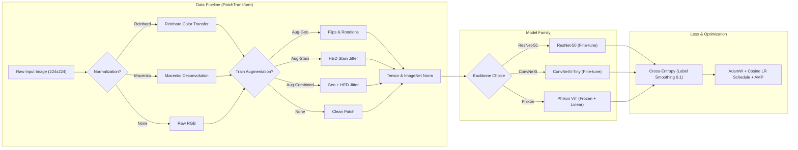

# Robust Histopathology Image Classification under Staining Variations
**Course Project Report — Deep Learning (DL2026)**  
**Group 1 · Project 32**  
**Repository:** `DL2026-1-32`

---

## 1. Abstract

Deep learning models achieve high accuracy in digital histopathology. However, when these models run on images from another hospital, their performance often drops sharply. This problem happens because staining chemicals, laboratory protocols, and slide scanners create large color variations between hospitals. In this project, we study how to make convolutional and transformer models robust against staining shifts in colorectal cancer tissue classification. We train models on 24,993 patches from the NCT-CRC-HE-100K-NONORM dataset (Heidelberg cohort) and test them on 7,180 unseen patches from the CRC-VAL-HE-7K dataset (Aachen cohort) across nine tissue classes. We design a 13-experiment ablation matrix to evaluate three defense axes: color normalization (Reinhard and Macenko), data augmentation (geometric transformations and biological HED stain jitter), and model backbones (ResNet-50, ConvNeXt-Tiny, and the Phikon foundation model). Our experiments reveal three key findings: stain normalization recovers up to 18 F1 points on external data; stain augmentation becomes redundant once normalization is applied; and pretrained foundation models show strong zero-shot stain robustness but suffer when artificial normalization alters their learned feature distributions. Our best-defended ResNet-50 model achieves an out-of-domain Macro-F1 score of 0.8689.

---

## 2. Introduction and Research Question

### 2.1. Clinical Background and Problem Statement
Colorectal cancer is a leading cause of cancer mortality worldwide. In clinical pathology, pathologists examine tissue biopsies under a microscope to confirm diagnosis and plan treatment. Tissue sections are routinely stained with **Hematoxylin** (staining cell nuclei purple-blue by binding to nucleic acids) and **Eosin** (staining cytoplasm, collagen, and muscle pink-red by binding to proteins), then digitized by whole-slide scanners.

While deep neural networks achieve high diagnostic accuracy on slides from their training hospital, their performance drops sharply when deployed at external medical centers. This degradation is caused by **inter-laboratory staining variation**: differences in chemical brands, reagent freshness, staining protocols, slice thickness, and scanner optical sensors produce pronounced color shifts between hospitals.

```text
Source Hospital (Heidelberg)             Target Hospital (Aachen)
- Deep purple hematoxylin bias           - Bright pink eosin bias
                 \                           /
                  \                         /
                   v                       v
               [Deep Learning Model Trained on Source]
                                |
             +------------------+------------------+
             |                                     |
             v                                     v
     In-Domain Evaluation                 Out-of-Domain Evaluation
   High Accuracy (~98.9% F1)            Severe Drop (~66.4% F1)
```

### 2.2. The Shortcut Learning Challenge
When a deep network is trained on images from a single hospital, it frequently learns color shortcuts instead of true biological features. For instance, if cancer regions at Hospital~A exhibit intense purple staining due to crowded nuclei, the network may simply learn: *"Dark purple means cancer; light pink means benign tissue"*. When deployed at Hospital~B, where normal tissue is stained darker or cancer tissue is lighter, the model fails. This phenomenon, known as **domain shift** or **out-of-distribution (OOD) degradation**, poses a critical risk in clinical workflows.

### 2.3. Research Questions
To determine what interventions effectively mitigate stain shift, we address five core questions:
- **RQ1 (Anchor Baseline):** How severely does domain shift degrade an undefended ResNet-50 when tested on an external hospital cohort?
- **RQ2 (Color Normalization):** Can statistical (Reinhard) or physical (Macenko) stain normalization restore external diagnostic accuracy?
- **RQ3 (Data Augmentation):** Does biological HED stain jitter during training match or exceed explicit normalization?
- **RQ4 (Defense Interaction):** Do stain normalization and data augmentation act synergistically, or do they conflict when combined?
- **RQ5 (Model Architecture):** Does a modern ConvNet (ConvNeXt-Tiny) or a self-supervised foundation model (Phikon) exhibit intrinsic stain invariance?


---

## 3. Related Work

Our research connects three major areas in computational pathology: stain normalization algorithms, data augmentation strategies, and pretrained vision backbones.

### 3.1. Stain Normalization Algorithms
Stain normalization algorithms adjust the color distribution of an input image to match a chosen reference image. Existing methods fall into two main families:

1. **Statistical Color Matching (Reinhard et al., 2001):**  
   Reinhard color transfer converts an RGB image into the perceptual $L\alpha\beta$ color space developed by Ruderman et al. (1998). In this space, the luminance channel ($L$) and the chromatic channels ($\alpha, \beta$) are statistically independent. The algorithm calculates the mean and standard deviation of each channel for both the source image and the target reference image. It then shifts and scales the source image channels to match the target statistics. This method is computationally fast and requires only simple matrix arithmetic.

2. **Optical Density Deconvolution (Macenko et al., 2009):**  
   Macenko normalization models the physical physics of light absorption using the **Beer-Lambert Law**:
   $$OD = -\log_{10}\left(\frac{I}{I_0}\right)$$
   where $I$ is the transmitted light intensity and $I_0$ is the incident light intensity. Macenko's method transforms RGB pixel values into Optical Density (OD) space. It applies Singular Value Decomposition (SVD) to find the two-dimensional plane containing the primary dye absorption vectors. By projecting pixel values onto this plane and identifying extreme angular percentiles (1st and 99th percentiles), the method calculates the distinct stain vectors for Hematoxylin and Eosin. It then normalizes stain concentration maps against a reference patch.

Other methods, such as sparse non-negative matrix factorization (Vahadane et al., 2016) and Generative Adversarial Networks (CycleGAN, StainGAN), also exist. However, Reinhard and Macenko remain the two most widely deployed algorithms in clinical workflows due to their deterministic behavior and lack of hallucinated tissue structures.

### 3.2. Data Augmentation Strategies
Instead of altering images during testing, data augmentation trains the network to ignore color variations by exposing it to diverse variations during training.
- **Spatial / Geometric Augmentation:** Standard transformations include random horizontal flips, vertical flips, and 90-degree rotations. Because tissue slides have no natural "up" or "down" orientation, geometric augmentation is a mandatory baseline for microscopy.
- **Stain Color Perturbation (Tellez et al., 2019):** Rather than simple RGB jittering, biologically-grounded stain jittering deconvolves images into separate Hematoxylin, Eosin, and background channels. The algorithm adds random scale and shift factors to individual dye concentrations. This forces the model to rely on structural morphology rather than specific dye intensity.

### 3.3. Vision Backbones and Foundation Models
Most prior benchmarks rely on classical ImageNet-pretrained CNNs:
- **ResNet-50 (He et al., 2016):** A 50-layer residual network that uses skip connections. It has served as the universal standard backbone in medical imaging for nearly a decade.
- **ConvNeXt-Tiny (Liu et al., 2022):** A modernized pure convolutional architecture that incorporates design choices from Vision Transformers, including $7 \times 7$ depthwise convolutions, inverted bottlenecks, LayerNorm, and GELU activations.
- **Pathology Foundation Models (Phikon, Filiot et al., 2023):** Built on the Vision Transformer (ViT-B/16) architecture, Phikon was trained by Owkin on 43 million histology tiles from The Cancer Genome Atlas (TCGA) using the self-supervised iBOT framework. Because it observed diverse slide preparations from hundreds of laboratories during pretraining, Phikon is hypothesized to have high intrinsic stain invariance.

---

## 4. Dataset and Data Preparation

### 4.1. Dataset Source and Official Benchmark Links
This project uses the established colorectal histology benchmark created by Kather et al. (2018, 2019). The benchmark provides two separate, non-overlapping collections of histological image tiles:

- **Official Zenodo Archive:** [https://doi.org/10.5281/zenodo.1214456](https://doi.org/10.5281/zenodo.1214456)
- **Dataset Version:** `v0.1` (Published: 2018-04-07; Verified: 2026-10-04)
- **License:** Creative Commons Attribution 4.0 International (CC BY 4.0)

| Dataset Identifier | Clinical Role | Patches | Resolution | Source Centers |
| :--- | :--- | :---: | :---: | :--- |
| `NCT-CRC-HE-100K-NONORM` | Source Domain (Train / Val-ID / Test-ID) | 100,000 | $224 \times 224$ px ($0.5\,\mu\text{m/px}$) | NCT Heidelberg & UMM Mannheim, Germany ($N=86$ patients) |
| `CRC-VAL-HE-7K` | Target Domain (Test-OOD) | 7,180 | $224 \times 224$ px ($0.5\,\mu\text{m/px}$) | University Hospital RWTH Aachen, Germany ($N=50$ patients) |

> **Important Note on the NONORM Variant:** The Zenodo repository also hosts a Macenko-normalized archive (`NCT-CRC-HE-100K.zip`). In this study, we strictly use the unnormalized **`NONORM`** archive. Preserving raw clinical staining variations in the source domain is necessary to test our normalization and augmentation hypotheses.

  
*Figure 1: Representative histological patches from the NCT-CRC-HE-100K-NONORM source domain (Heidelberg/Mannheim cohort).*

  
*Figure 2: Representative histological patches from the CRC-VAL-HE-7K target domain (Aachen cohort).*

### 4.2. Nine Histological Classes
Both datasets contain nine mutually exclusive tissue classes commonly found in colorectal cancer specimens:

| Label Index | Code | Class Name | Biological Description | Target Count (`CRC-VAL-7K`) |
| :---: | :--- | :--- | :--- | :---: |
| 0 | `ADI` | Adipose | Lipid-filled fat cells with thin borders and clear cytoplasm | 1,338 |
| 1 | `BACK`| Background | Clear glass slide areas with no tissue | 847 |
| 2 | `DEB` | Debris | Necrotic cell fragments, hemorrhage, and cautery artifacts | 339 |
| 3 | `LYM` | Lymphocytes | Dense clusters of small, dark, round immune cell nuclei | 634 |
| 4 | `MUC` | Mucus | Amorphous extracellular pools of light basophilic mucus | 1,035 |
| 5 | `MUS` | Smooth Muscle | Compact bundles of pink-staining spindle-shaped muscle fibers | 592 |
| 6 | `NORM`| Normal Mucosa | Organized healthy glandular structures with goblet cells | 741 |
| 7 | `STR` | Stroma | Fibrous collagenous connective tissue and desmoplastic stroma | 421 |
| 8 | `TUM` | Colorectal Carcinoma | Malignant glandular epithelium with enlarged, irregular nuclei | 1,233 |
| **Total** | | | **All 9 tissue categories from 50 independent patients** | **7,180** |

### 4.3. Data Subsampling and Partitioning Protocol
To allow all 13 experimental configurations to complete within a single Kaggle GPU session (~3.5 hours on an Nvidia T4 GPU), we use a standardized subset budget of 25,000 patches from the 100,000-patch source pool:
1. **Per-Class Subsampling:** The budget is divided evenly across all 9 classes using integer division:
   $$\text{Patches per class} = \lfloor 25,000 / 9 \rfloor = 2,777$$
   $$2,777 \times 9 = \mathbf{24,993\text{ total source patches}}$$
2. **Stratified Split (70 / 15 / 15):** The 24,993 source patches are split using two consecutive stratified `train_test_split` calls (`random_state=42`):
   - **Training Set (`train.csv`):** 70% $\rightarrow$ **17,495 patches** (used for model weight optimization).
   - **In-Domain Validation Set (`val_id.csv`):** 15% $\rightarrow$ **3,749 patches** (used strictly for per-epoch checkpoint selection).
   - **In-Domain Test Set (`test_id.csv`):** 15% $\rightarrow$ **3,749 patches** (evaluated once post-training to measure in-domain performance).
3. **Out-of-Domain External Set (`test_ood.csv`):** 100% of the `CRC-VAL-HE-7K` dataset $\rightarrow$ **7,180 patches**.

```text
Source Pool: NCT-CRC-HE-100K-NONORM
  │
  └── Stratified Sampling (2,777 per class) ──► 24,993 patches
                                                    │
        ┌───────────────────────────────────────────┴───────────────────────────────────────────┐
        ▼                                           ▼                                           ▼
  Train Split (70%)                           Val-ID Split (15%)                          Test-ID Split (15%)
  17,495 patches                              3,749 patches                               3,749 patches
  (Model weight optimization)                 (Best checkpoint selection)                 (In-domain test benchmark)

Target Pool: CRC-VAL-HE-7K
  │
  └── Strict Domain Firewall ─────────────────────────────────────────────────────────────► Test-OOD Split (100%)
                                                                                          7,180 patches
                                                                                          (External hospital test)
```

### 4.4. The Strict Domain Firewall Rule
To guarantee valid scientific evaluation, the target dataset (`CRC-VAL-HE-7K`) is protected by a strict domain firewall:
- It is never included in training sets.
- It is never used to fit color normalizers.
- It is never consulted for hyperparameter selection or early stopping.
- It is loaded and evaluated exactly once per experiment after training is completely finished.

### 4.5. Canonical Stain Reference Tile Selection
All color normalization experiments require a single target reference image. In our pipeline, this reference tile is chosen deterministically as the **very first `TUM` patch in the training split** and saved to `results/splits/reference_stain.png`. Selecting a dense tumor patch from the training split ensures that the reference contains strong, balanced signals of both Hematoxylin (nuclei) and Eosin (stroma) without causing data leakage from test sets.

  
*Figure 3: The canonical reference patch (`results/splits/reference_stain.png`) used for all Reinhard and Macenko normalization steps.*

---

## 5. Methods



## 5. Methods

This section details our anchor baseline, the proposed defense framework, and the comparison strategy used to quantify stain robustness.

### 5.1. Baseline Method
Our anchor baseline (**EXP-01**) uses a standard **ResNet-50** architecture initialized with ImageNet-1k weights (`resnet50.a1_in1k` from the `timm` library). 
- **Preprocessing:** Raw RGB images are resized to $224 \times 224$ pixels without color normalization (`norm=none`).
- **Augmentation:** Deterministic input pipeline without spatial transformations or color jittering (`aug=none`). Only standard ImageNet channel standardization is applied:
  $$\mu = [0.485, 0.456, 0.406], \quad \sigma = [0.229, 0.224, 0.225]$$
- **Optimization:** AdamW optimizer with initial learning rate $\eta = 1 \times 10^{-3}$, weight decay $\lambda = 0.05$, and a Cosine Annealing learning rate schedule decaying to $\eta_{\min} = 1 \times 10^{-5}$ over 8 epochs.
- **Objective Function:** Cross-entropy loss with label smoothing ($\alpha = 0.1$) to prevent overconfident output distributions:
  $$\mathcal{L}_{\text{LS}} = (1 - \alpha)\mathcal{L}_{\text{CE}} + \frac{\alpha}{K}\sum_{k=1}^K -\log p_k$$
  where $K = 9$ classes.

### 5.2. Main Proposed Method
Our primary defense framework combines:
1. **Macenko Optical Density Normalization:** Every input patch is deconvolved into optical density space. Its stain vectors and 99th-percentile dye concentrations are scaled to match the canonical reference patch before entering the neural network.
2. **Combined Spatial and Stain Augmentation (`Aug-Combined`):** During training, patches undergo random horizontal flips ($p=0.5$), vertical flips ($p=0.5$), and random 90-degree rotations, combined with stochastic HED stain concentration jittering ($p=0.8$, concentration scale $\alpha \in [0.8, 1.2]$, concentration bias $\beta \in [-0.05, 0.05]$).
3. **Histology Foundation Model (Phikon):** A Vision Transformer (ViT-B/16) pretrained on 43 million histology tiles using self-supervised learning. The 86-million parameter ViT encoder is frozen (`requires_grad = False`), and a linear probe head:
   $$f_{\text{head}}(x) = W x_{[\text{CLS}]} + b \quad (W \in \mathbb{R}^{9 \times 768}, \; b \in \mathbb{R}^9)$$
   is trained on top of the extracted 768-dimensional `[CLS]` token representations using learning rate $\eta = 3 \times 10^{-4}$.

### 5.3. Comparison Strategy and Metrics
To fairly evaluate the impact of each technique, we measure classification performance across both domains using two primary metrics and two robustness quantifiers:

1. **Primary Metric — Macro-averaged F1 Score (`Macro-F1`):**  
   We calculate the harmonic mean of precision and recall for each class $c \in \{0, \dots, 8\}$, then take the unweighted arithmetic mean across all 9 classes:
   $$\text{Macro-F1} = \frac{1}{9}\sum_{c=0}^8 \frac{2 \cdot \text{Precision}_c \cdot \text{Recall}_c}{\text{Precision}_c + \text{Recall}_c}$$
   This metric weights all tissue categories equally, preventing majority classes (such as `ADI`) from hiding poor diagnostic performance on minority classes (such as `DEB`).
2. **Secondary Metric — Top-1 Accuracy (`Acc`):** The overall percentage of correctly classified patches.
3. **Absolute Performance Drop ($\Delta\text{-F1}$):**  
   $$\Delta\text{-F1} = \text{F1}_{\text{ID}} - \text{F1}_{\text{OOD}}$$
   *(Lower is better; $\Delta\text{-F1} = 0$ represents perfect stain invariance).*
4. **Relative Retention Rate ($\text{RR}_{\text{F1}}$):**  
   $$\text{RR}_{\text{F1}} = \left(\frac{\text{F1}_{\text{OOD}}}{\text{F1}_{\text{ID}}}\right) \times 100\%$$
   *(Higher is better; $100\%$ indicates zero performance loss across medical centers).*

---

## 6. Experimental Setup

Our experimental campaign follows a three-part setup to systematically evaluate stain robustness:

### 6.1. Setup 1 — Baseline vs. Key Defended Models
We contrast three anchor configurations to evaluate the overall impact of defenses:
- **Anchor Baseline (EXP-01):** ResNet-50 trained on raw, unnormalized patches without data augmentation.
- **Peak Defended Model (EXP-07):** ResNet-50 combined with Macenko stain normalization and geometric augmentation.
- **Histology Foundation Model (EXP-12):** Undefended Phikon (ViT-B/16) linear probe, testing self-supervised representations learned from 43 million TCGA tiles.

### 6.2. Setup 2 — Main Research Experiment (13-Cell Ablation Matrix)
To isolate individual and joint effects, we design a 13-experiment ablation matrix across five progressive stages:
- **Stage 0 (EXP-01):** Establishes the unmitigated domain shift drop under raw staining.
- **Stage 1 (EXP-02, 03):** Evaluates statistical (Reinhard) vs. physical (Macenko) stain normalization.
- **Stage 2 (EXP-04, 05, 06):** Assesses spatial flips/rotations vs. biological HED stain jitter vs. their combination.
- **Stage 3 (EXP-07, 08, 09):** Investigates interactions between Macenko normalization and augmentation policies.
- **Stage 4 (EXP-10 to 13):** Compares modern ConvNet (ConvNeXt-Tiny) and Vision Transformer (Phikon) backbones under undefended vs. fully defended settings.

### 6.3. Setup 3 — Targeted Robustness Analysis
We dissect the results across four comparative axes:
1. **Axis A (Normalization):** EXP-01 vs. EXP-02 vs. EXP-03 (holding architecture and augmentation fixed).
2. **Axis B (Augmentation):** EXP-01 vs. EXP-04 vs. EXP-05 vs. EXP-06 (without stain normalization).
3. **Axis C (Defense Synergy vs. Conflict):** EXP-03 vs. EXP-07 vs. EXP-08 vs. EXP-09 (testing if augmentation aids or impairs normalized tiles).
4. **Axis D (Backbone Invariance):** Standard CNN vs. modern ConvNet vs. ViT foundation model under raw (EXP-01, 10, 12) and defended (EXP-09, 11, 13) conditions.

### 6.4. Implementation and Training Environment
All pipelines are implemented in PyTorch 2.x and executed on a single Kaggle cloud instance equipped with an Nvidia Tesla T4 GPU (16 GB VRAM). Models are optimized using AdamW ($\lambda = 0.05$, initial $\eta = 10^{-3}$ for CNNs, $\eta = 3 \times 10^{-4}$ for the Phikon linear head) with a cosine annealing schedule over 8 epochs (batch size 64). Training uses automatic mixed precision (`torch.amp`), and model selection strictly retains the checkpoint with the highest Macro-F1 on the in-domain validation split (`val_id`). The total runtime across all 13 cells is approximately 3.5 hours.
